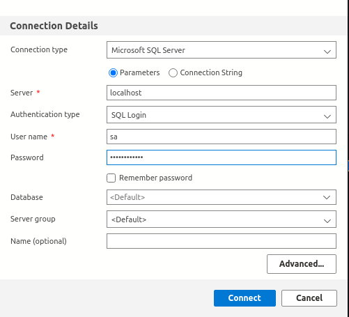

# Install MSSQL/SQL Server and Azure Data Studio on Ubuntu

## SQL Server Developer 2019

```bash
docker-compose up -d
```

Note that the password for the SA account is specified in the docker-compose file using the `MSSQL_SA_PASSWORD` environment variable. Use this password to sign in with the SA account, using the __SQL Login__ Authentication Type.

## Azure Data Studio

Download the deb file
```bash
wget https://go.microsoft.com/fwlink/\?linkid\=2204570 -O azure-data-studio.deb
```

Install Azure Data Studio
```bash
dpkg -i azure-data-studio.deb
```

Log in as below:



## References

1. [Download Azure Data Studio](https://learn.microsoft.com/en-us/sql/azure-data-studio/download-azure-data-studio?view=sql-server-ver16)
2. [Run SQL Server Linux container images with Docker](https://learn.microsoft.com/en-us/sql/linux/quickstart-install-connect-docker?view=sql-server-linux-ver15&pivots=cs1-bash)
3. [Healthcheck for MSSQL in Docker](https://github.com/Microsoft/mssql-docker/issues/133)